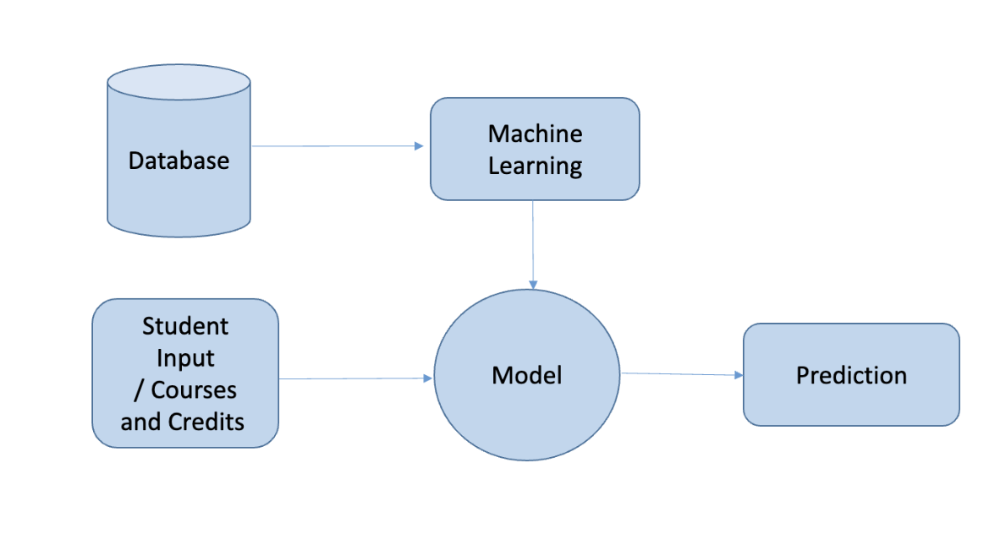
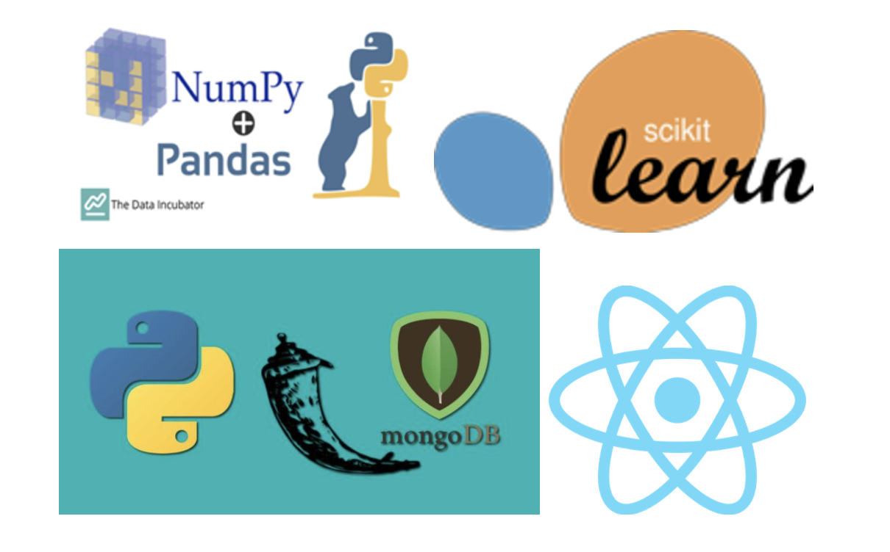
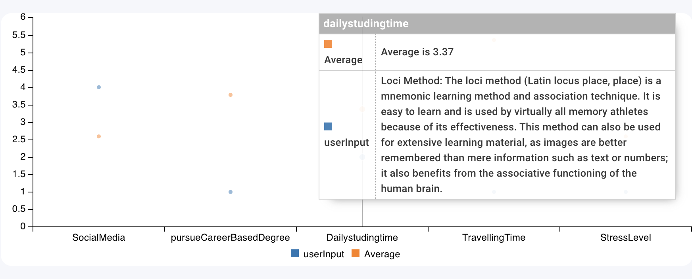
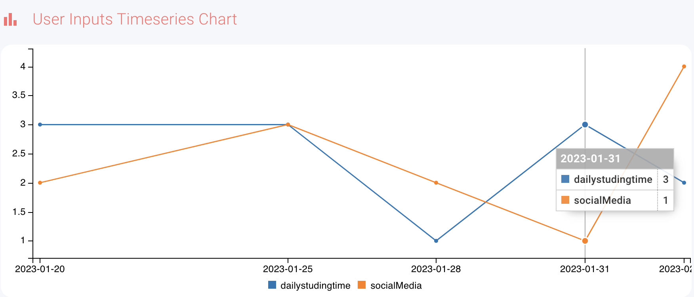

# Project Overview

**Goal Evaluator** as tool for identification of problematic studying behaviour of students and advices on learning optimization

## Dataset Description
Categorised based on 3 main datasets :

* Student Behavior Study​
* Courses and Credits​
* Students Information

You could find the “Student Behavior Study​ ” dataset at this link : https://la-api.codeiin.com/students/behaviour

## project architecture

## Implementation Technologies 

This project is based on the following technologies:
 * Front-End
   * Dashboard
   * React.js library
 * Visualisation
   * D3.js / C3.JS
 * Back-End
  * Web Server
    * Python
    * Flask
 * Machine Learning Pipeline
   * Scikits Learn
 * Database
   * mongoDB

## Machine Learning Pipeline

Machine Learning with sklearn, pandas.  
To run the  code you need to import standard libraries for data preparation and analysis.

import numpy as np  
import pandas as pd  
import requests  
import json  
import numpy as np  
import seaborn as sns  
import matplotlib.pyplot as plt   

**Phases**

* Outlier Detection (LocalOutlierFactor)
* Feature Selection (Feature Importances)
* Model Selection 
* Hyper Parameter Tuning on the RidgeRegression Model including KFold Cross Validation(GridSearchCV)
  * Parameters to be optimize: param = { 'solver':['svd', 'cholesky', 'lsqr', 'sag'],'alpha': [1e-5, 1e-4, 1e-3, 1e-2, 1e-1, 1, 10, 100], 'fit_intercept':[True, False],'normalize':[True, False]}
  * Optimization parameter: 'neg_mean_absolute_error'

## Visualisation
All Visualisation chart is built using:
C3/D3.js

## To deploy the project
you need to install below requirements on our system:

**For the server:**
First Download Python-3.9.16

you need to install the requirements on our system:

pip install -r requirements.txt
### or
pip3 install -r requirements.txt

**Installation for Macbook M1** 

* brew install miniforge
* conda create -n sklearn-env -c conda-forge scikit-learn --file requirements.txt
* conda activate sklearn-env

**How to Run :** 

* conda activate sklearn-env
* python ./src/main.py

**For the Frontend:**

To install the packages run :
* npm install

Then, run the development server:
* npm run dev
### or
* yarn dev
